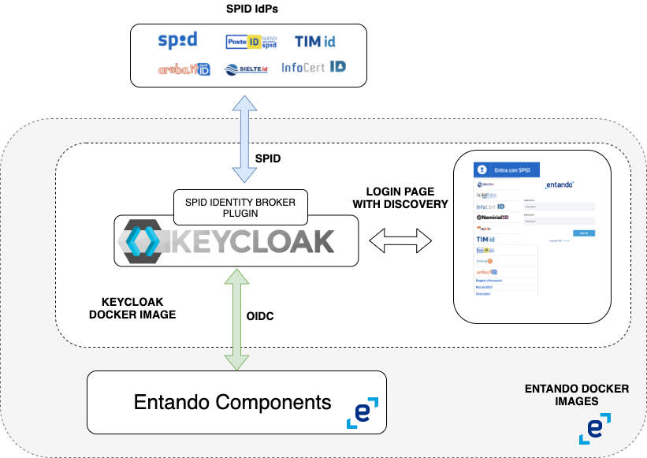

## Entando SPID Integration

### The context
Entando (https://www.entando.com/) is a modern platform that enables fast development of applications in cloud native scenarios, leveraging best practices for software application architecture and development.
It uses keycloak (https://www.keycloak.org/) as identity access manager

### The needs
To easily allow users to use Italian SPID identity providers (https://www.spid.gov.it/) to authenticate themselves in Entando applications 

### The solution
It is based on conf

The solution key steps are:
1. Use of keycloak for Identity Brokering (https://www.keycloak.org/docs/latest/server_admin/index.html#_identity_broker)
   - This allows Entando to continue using Keycloak as the only IAM   
2. Create a new Entando Keycloack Image with the SPID Identity Provider Type (https://github.com/lscorcia/keycloak-spid-provider) and a new spid theme, containing the official discovery button. 
   - That new type will be used in the configuration phase of the Identity Brokering
4. Patch the entando installation .yaml with the new entando keycloak image
   - Entando is a cloud native platform composed of many collaborating docker containers.
   You can find the complete images list for one release, in this case the 6.3.0, at the address https://raw.githubusercontent.com/entando/entando-releases/v6.3.0/dist/qs/entando.yaml (look for `# Source: preview/charts/operator/templates/docker-image-info-configmap.yaml`)
   patch the above with the new keycloak image and follow the installation steps at the following address https://dev.entando.org/v6.3/docs/getting-started/#manual-install for the installation steps  
5. Configure keycloak with the spid Identity Providers
   - You can use the keycloack spid provider configuration client in order to avoid do it manually (https://github.com/lscorcia/keycloak-spid-provider/wiki) 

### 1. Create the Entando keycloak image
Switch to keycloack-image folder and follow the README instructions, deploy the image to a dockerhub

### 2. Patch the Entando installation
Follow the instructions at the url https://dev.entando.org/next/docs/getting-started/#manual-install up to "Download Helm Chart" section
after `curl -L -C - -O https://raw.githubusercontent.com/entando/entando-releases/v6.3.0/dist/qs/entando.yaml` open the entando.yaml file and change the keycloak image: `entando-keycloak: >-
{"version":"6.3.1","executable-type":"jvm","registry":"docker.io","organization":"entando"}` to wherever you have deployed to dockerhub
continue with the original installation

### 3. Configure keycloak
In this step you are going to use the keycloak-spid-provider-configuration-client, check the README file in the folder for details
Unfortunately you cannot currently use the create-realm npm run command, when keycloak is already deployed in Entando, so you have to go through a single step in the manual configuration: https://github.com/lscorcia/keycloak-spid-provider/wiki/Configuring-the-Authentication-Flow
N.B.: Pay attention to the name of the newly created Identity Provider
After that you can use the other npm run commands: create-idps, create-spmetadata
N:B:: There is some issue with the spid-testenv2 certificate, so you might be forced to disable the signature validation for that identity provider
Change the realm theme to spid

### 4. Configure the test idps spid-testenv2
Remember to use the spmetadata.xml file to configure the spid-testenv2

### Test it
You can use the kc-html-test-client/keycloak-client-test.html page to test your login/logout process.
Configure the script tag inside and the content of keycloak-*.json accordingly to your installation

### Change the theme
You can create your own theme starting from the spid one inside keycloak-image folder (https://www.keycloak.org/docs/latest/server_development/#_themes)

### Troubleshoot
Check the pod quickstart-kc-server-deployment-* log

### Debugging and local development
You can run the docker image in isolation, and also debug the code `docker run -e KEYCLOAK_USER=<USERNAME> -e KEYCLOAK_PASSWORD=<PASSWORD> -e DEBUG=true -e DEBUG_PORT='*:8787' -p 8080:8080 -p '8787:8787' jboss/keycloak` (https://hub.docker.com/r/jboss/keycloak/)
The most valuable part to debug is the plugin code (https://github.com/lscorcia/keycloak-spid-provider). Check the SpidSAMLEndpoint class for the SPID error management

### TODO
- SPID Error management
- Resolve the single manual step config issue
- https://github.com/lscorcia/keycloak-spid-provider/wiki/Open-issues-and-limitations

